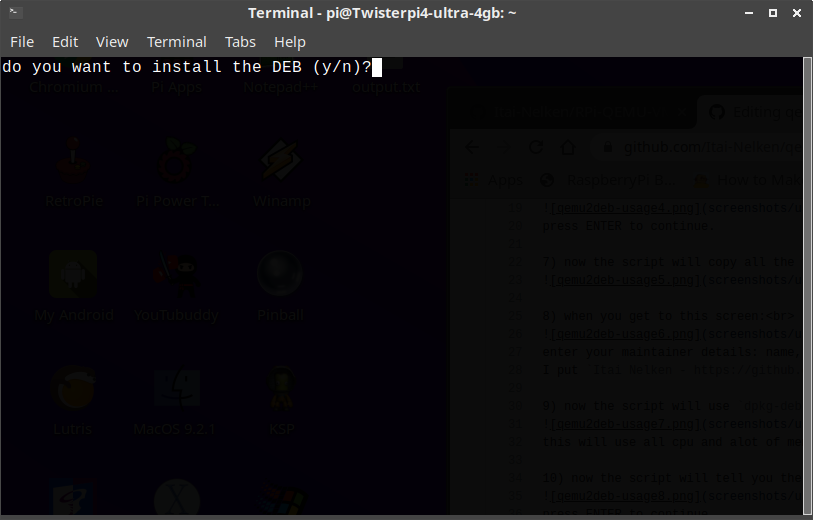

# Detailed usage instructions:
1) create a working directory, inside this directory the deb will be created and if needed QEMU compiled. example: `/home/$USER/Documents/debpkg/`

2) download and run the script using the instructions in the [README](https://github.com/Itai-Nelken/qemu2deb-RPi#usage).

3) when you get to this screen: 
 
enter the path to the file you created in step 1.

4) when you get to the following screen: 
 
enter the path to your already compiled and installed QEMU folder or if you didn't compile QEMU press s.

5) when you get to this screen: 
 
press ENTER if the data is correct or CTRL+C to cancel.

6)when you get to this screen: 
 
press ENTER to continue.

7) now the script will copy all the files from the installation on your system to a temporary folder that later will be packaged to a deb. 
 

8) when you get to this screen: 
 
enter your maintainer details: name, email address, link etc.
I put `Itai Nelken - https://github.com/Itai-Nelken/`

9) now the script will use `dpkg-deb` to build the deb. 
 
this will use all cpu and alot of memory (RAM).

10) now the script will tell you the path to the deb and its name
 
press ENTER to continue.

11) now the script will ask you if you want to install the DEB,
 
answer whatever you want, if you answer yes, you might see a few errors. that is won't affect anything and I'm trying to fix it.

12) now the script will start cleaning up after itself, answer whatever you want.
 
 
 
the finished deb:
 
